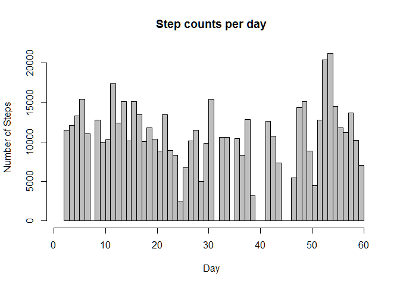
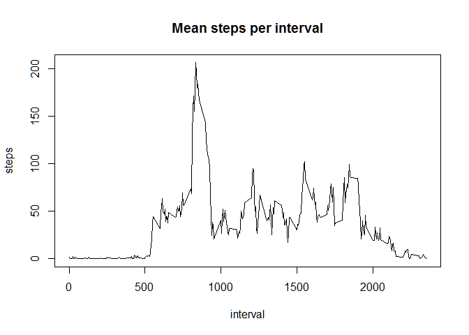
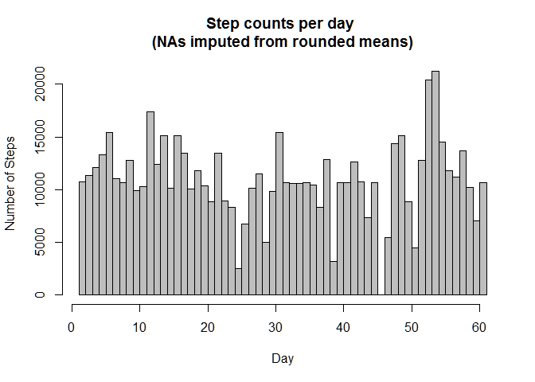
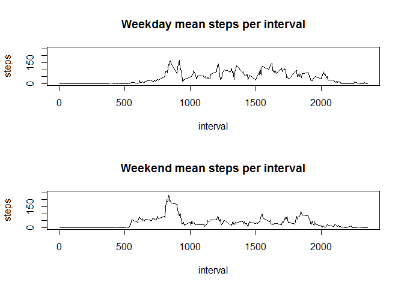

# Reproducible Research: Peer Assessment 1
Robert Botto  


***

## Loading and preprocessing the data

Read in CSV data.

```r
activity <- read.csv(unz("activity.zip", "activity.csv"))
```

***

## What is mean total number of steps taken per day?

First summarize the number of steps for each day.  Convert categorical dates to day number (starting with one) for the histogram x-axis.


```r
steps.per.day <- aggregate(steps ~ as.numeric(date), 
                           activity, sum, na.rm = TRUE)
```

Reshape steps as a vector of integers (representing day 1, day 2, etc.) as appropriate for a histogram. 


```r
steps.vector <- steps.per.day[rep(1:nrow(steps.per.day), 
                                  steps.per.day$steps), 1]
```

Plot histogram from steps vector


```r
hist(steps.vector, 
     breaks=max(steps.per.day[,1]),
     main="Step counts per day",
     xlab="Day",
     ylab="Number of Steps",
     xlim=c(1, max(steps.per.day[,1])),
     ylim=c(0, max(steps.per.day$steps)),
     col="grey")
```

<!-- -->

* **Mean** total steps per day = 10766.19.
* **Median** total steps per day = 10765.

***

## What is the average daily activity pattern?

Aggregate the mean steps per daily interval and plot.  


```r
mean.steps.per.interval <- 
    aggregate(steps ~ interval, activity, mean, na.rm = TRUE)

plot(mean.steps.per.interval, 
     type = "l",
     main="Mean steps per interval")
```

<!-- -->


```r
daily.interval.count <- length(mean.steps.per.interval$interval)
daily.interval.range <- range(mean.steps.per.interval$interval)
```

Note there are **288** five minute intervals per day, numbered **0** through **2355**.


```r
mean.steps.per.interval.max.idx <- 
     mean.steps.per.interval[which.max(mean.steps.per.interval$steps),1]
mean.steps.per.interval.max.val <- max(mean.steps.per.interval$steps)
```

On average interval **835** contains the largest number of steps (206.17).  


***

## Imputing missing values


```r
activity.na.count <- sum(is.na(activity$steps))
```

The activity dataset is missing **2304** values, or 8 days.

Impute missing date points from interval means rounded to integer values.


```r
activity.impute <- activity
activity.impute[which(is.na(activity$steps)), "steps"] <- 
    sapply(which(is.na(activity$steps)), function(i) { 
        as.integer(mean.steps.per.interval[
            mean.steps.per.interval$interval==activity[i,"interval"],
            "steps"
        ])
})
```

Plot new histogram with imputed values.


```r
steps.per.day.impute <- aggregate(steps ~ as.numeric(date), activity.impute, sum, na.rm = TRUE)
steps.impute.vector <- steps.per.day.impute[rep(1:nrow(steps.per.day.impute), 
                                  steps.per.day.impute$steps), 1]
hist(steps.impute.vector, 
     breaks=max(steps.per.day.impute[,1]),
     main="Step counts per day \n(NAs imputed from rounded means)",
     xlab="Day",
     ylab="Number of Steps",
     xlim=c(1, max(steps.per.day.impute[,1])),
     ylim=c(0, max(steps.per.day.impute$steps)),
     col="grey")
```

<!-- -->

* **Mean** total steps per day = 10749.77.
* **Median** total steps per day = 10641.

Both the mean and the median have been driven down a bit due to rounding the mean step counts for the imputed observations.

***

## Are there differences in activity patterns between weekdays and weekends?

Add new factor variable indicating the part of the week: weekday or weekand.


```r
activity.impute$weekpart <- factor(
    as.numeric(
        substr(
            weekdays(
                as.POSIXct(
                    as.character(
                        activity.impute[, "date"]))), 1, 1) != "S"), 
    labels = c("weekday", "weekend"))
```

Split activity into weekend and weekday interval means.


```r
activity.impute.split = split(activity.impute, activity.impute$weekpart)

mean.steps.per.interval.weekday = 
    aggregate(steps ~ interval, activity.impute.split[["weekday"]], mean, na.rm = TRUE)

mean.steps.per.interval.weekend = 
    aggregate(steps ~ interval, activity.impute.split[["weekend"]], mean, na.rm = TRUE)
```

Plot the means.


```r
par(mfrow=c(2,1))
plot(mean.steps.per.interval.weekday, 
     type="l", 
     main="Weekday mean steps per interval",
     ylim=c(0, 250))
plot(mean.steps.per.interval.weekend, 
     type="l", 
     main="Weekend mean steps per interval",
     ylim=c(0, 250))
```

<!-- -->
